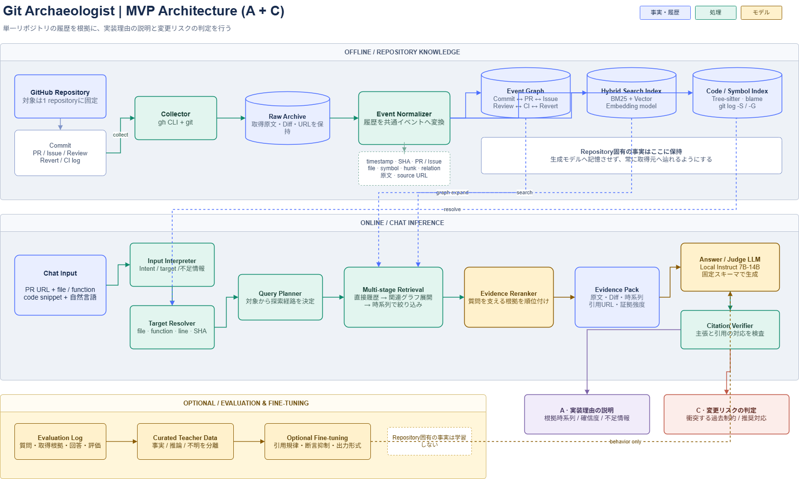

# Plan: Git Archaeologist

Git Archaeologistは、一つのGitHub Repositoryに蓄積されたCommit、Pull Request、Issue、Review、Revert、CIログなどを横断的に分析し、「なぜこの実装が現在の形になったのか」を説明するローカルAIシステムです。変更履歴を検索するだけでなく、関連する議論、障害、設計上の制約を時系列で整理し、判断に至った過程を根拠付きで提示します。

利用者は、PR URLとファイル名・関数名、またはコード断片と質問をチャット形式で入力します。システムは対象コードを特定し、実装理由の説明、過去の設計判断との衝突、障害やRevertとの関連を回答します。回答では、履歴から確認できた事実とシステムによる推論を分け、引用元、確信度、不足している情報を明示します。

中心方針は、Repository固有の知識をRAGで取得し、モデルには取得した根拠に基づく説明と判定を行わせることです。GitHubの履歴そのものはモデルに記憶させず、`gh` CLIと`git`から取得した原文と関係情報を検索基盤に保持します。Fine-tuningは必須とはせず、評価によって根拠のない断言、引用の不整合、事実と推論の混同などが繰り返し確認された場合に、根拠の扱い、原因分析、障害分析、レビュー判断、回答形式を改善する目的で導入します。

## 構成

MVP では、学習対象と回答対象を一つの GitHub Repository に限定します。Repository 固有の事実はモデルのパラメータに記憶させず、`gh` CLI と `git` から取得した履歴を検索基盤に保持します。モデルは、取得した根拠の整理、実装理由の説明、変更リスクの判定を担当します。

### 履歴収集・知識基盤

`gh` CLI から PR、Issue、Review、コメント、CI Run を取得し、`git` から Commit、Diff、Blame、Revert、ファイルおよびシンボルの変更履歴を取得します。取得した原文、Diff、URL は Raw Archive に保存し、後から回答の根拠へ辿れる状態を維持します。

収集した履歴は、文書単位ではなく、次の情報を持つ共通イベントへ正規化します。

- イベント種別: Commit、PR、Issue、Review、CI failure、Revert
- 発生日時、Commit SHA、PR・Issue番号、作成者
- 対象ファイル、関数・クラスなどのシンボル、Diff hunk
- 関連イベントとその関係
- 原文、要約、取得元URL

正規化したイベントから、以下の検索基盤を構築します。

- Event Graph: Commit、PR、Issue、Review、CI、Revertの関係を保持する
- Hybrid Search Index: キーワード検索とベクトル検索を組み合わせる
- Code / Symbol Index: Tree-sitter、`git blame`、`git log -S`、`git log -G`を利用してコードと履歴を対応付ける

### チャット入力と対象解決

利用者は、PR URLとファイル名または関数名、もしくはコード断片と自然言語による質問をチャットへ入力します。Input Interpreterが質問の意図を分類し、Target Resolverが対象Repository内のファイル、シンボル、行、Commit SHAを特定します。

コード位置の特定には決定的な検索処理を優先し、LLMの推測だけでは対象を確定しません。対象を一意に特定できない場合は、候補を提示するか追加情報を求めます。

### 検索・根拠生成

Query Plannerは、解決された対象から探索経路を決定します。検索は一度のベクトル検索ではなく、次の順序で行います。

1. 対象シンボルを導入または変更したCommitとDiffを取得する
2. Commitに関連するPR、Issue、Review、CI、Revertへ展開する
3. 対象シンボルと時系列で候補を絞り込む
4. Evidence Rerankerが質問を直接支える根拠を順位付けする
5. 原文、Diff、時系列、取得元URL、証拠強度をEvidence Packにまとめる

これにより、検索結果の類似度だけでなく、変更の因果関係と時間的な前後関係を回答へ反映します。

### モデル構成

モデルは、役割を分離した三つの構成とします。

- Embedding Model: 日本語、英語、コードを含む履歴の検索候補を生成する
- Evidence Reranker: 検索候補を質問への関連性と根拠の強さで並べ直す
- Answer / Judge LLM: Evidence Packの範囲内で説明とリスク判定を生成する。MVPではローカルで動作する7Bから14B程度のInstruct Modelを想定する

回答生成後はCitation Verifierが、各主張を引用元が実際に支えているか、事実と推論が混同されていないかを検査します。

### MVPの回答機能

MVPでは、実装理由の説明と変更リスクの判定を同じ検索基盤上で提供します。

- 実装理由の説明: 指定されたファイルまたは関数が、なぜ現在の実装になったのかを時系列と根拠付きで説明する
- 変更リスクの判定: 指定されたPRまたは変更内容が、過去の障害、互換性制約、レビュー上の判断を損なう可能性を判定する

回答には、判定、確認できた理由、根拠、推論、潜在リスク、推奨対応、確信度、不足情報を含めます。根拠が不足している場合は理由を断定せず、Repository内の履歴から確認できる範囲を明示します。

### Fine-tuning

Fine-tuningはRepository固有の履歴を記憶させる目的では使用しません。RAGベースの評価で、事実と推論の混同、根拠のない断言、引用の不整合、Revertや時系列の読み違い、過剰なリスク警告が繰り返し確認された場合に導入します。

教師データはGitHubの生データをそのまま使用せず、質問、Evidence Pack、理想回答、評価ラベルの組として作成します。学習対象は、根拠の扱い、断言の抑制、回答形式、原因分析とレビュー判断の進め方に限定します。

## ロードマップ

最初に、実装理由の説明と変更リスクの判定をMVPとして成立させます。その後、障害・Revert分析、行・条件分岐レベルの分析の順で対象を拡張します。各フェーズで評価データを蓄積し、検索精度と根拠の信頼性を確認してから次へ進みます。

### フェーズ1: MVP - 実装理由説明と変更リスク判定

単一Repositoryを対象に、履歴の収集からチャット回答までの最小構成を実装します。

- `gh` CLIと`git`によるCommit、PR、Issue、Review、CI、Revertの一括収集
- Raw Archive、共通イベント形式、Event Graphの構築
- キーワード検索、ベクトル検索、Code / Symbol Indexの構築
- PR URLとファイル・関数名、およびコード断片と自然言語からの対象解決
- Evidence RerankerによるEvidence Packの生成
- ファイル・関数単位の実装理由説明
- PRまたは変更内容と過去の制約との衝突判定
- 引用、事実と推論の区別、確信度、不足情報を含む回答形式

MVPの評価用として、対象Repositoryから質問、期待する根拠、理想回答、リスクラベルを持つデータセットを作成します。完了条件は、対象コードを安定して特定できること、回答中の主要な主張が取得元により裏付けられること、根拠不足時に断言を避けられること、変更リスクの警告が実用可能な精度であることです。

### フェーズ2: MVPの安定化

実際の質問と評価結果を用いて、実装理由説明と変更リスク判定を継続利用できる品質へ引き上げます。

- 差分取得による履歴の増分更新
- 検索結果とEvidence Packのキャッシュ
- 対象解決、検索、Rerank、回答生成のログとトレース
- 引用元の消失、取得失敗、曖昧な対象に対するエラー処理
- Citation Verifierと回帰評価の自動化
- 回答時間、検索再現率、引用整合率、警告の適合率の計測

この段階で、プロンプトとRAGの改善だけでは解消しない失敗パターンを特定します。事実と推論の混同、根拠のない断言、回答形式の崩れなどが反復する場合に限り、推論様式を対象としたFine-tuningを導入します。

### フェーズ3: 障害・Revert分析

過去の障害やRevertについて、発生から復旧までの因果関係を説明できるようにします。

- CI失敗をテスト名、エラー、対象Commit、Workflow単位の障害イベントへ変換
- 障害を導入した変更、検出したCI、関連Issue、修正PR、Revertの連結
- 同種障害の再発履歴と、影響したファイル・シンボルの抽出
- 「何が危険だったか」「どの変更で解消したか」「現在も制約が残るか」の回答
- 変更リスク判定へ障害パターンとRevert履歴を反映

完了条件は、代表的な障害について導入、検出、対応、復旧の時系列を根拠付きで再構成でき、直接確認できた原因と推定した原因を区別できることです。

### フェーズ4: 行・条件分岐レベルの考古学

ファイル・関数単位から、特定の行や条件分岐が存在する理由の説明へ解像度を上げます。

- `git blame`とDiff hunkによる行の起源追跡
- 関数名変更、ファイル移動、コード移植、リファクタリングを跨ぐシンボル系譜の追跡
- 条件式と周辺テストの変更履歴の関連付け
- 追加理由と、その後も残されている理由の分離
- 同一コード断片が複数存在する場合の候補提示と曖昧性処理

完了条件は、単純な行移動やリファクタリングを跨いでも起源となる変更へ到達でき、条件分岐の導入理由、維持理由、関連する過去の不具合を個別の根拠で説明できることです。

### フェーズ5: 完成形

四つの機能を一つのチャット体験として統合し、Repositoryの更新に追従するローカルシステムとして完成させます。

- ファイル・関数単位の実装理由説明
- 行・条件分岐単位の起源と維持理由の説明
- 変更内容が過去の設計判断や障害対策を損なうリスクの判定
- 障害、CI失敗、Revert、復旧までの因果分析
- Repository履歴の定期的な増分同期と索引更新
- 回答からCommit、PR、Issue、Review、CIログへ辿れる根拠表示
- 評価セットによるモデル、検索、プロンプト変更時の回帰検査
- ローカル実行環境に応じたモデル量子化、推論速度、メモリ使用量の最適化

完成条件は、すべての回答が根拠へ追跡可能であり、根拠がない場合は不明と回答できること、四つの機能が同じイベント基盤とEvidence Packを再利用できること、新しい履歴を追加しても再学習なしで回答へ反映できることです。
